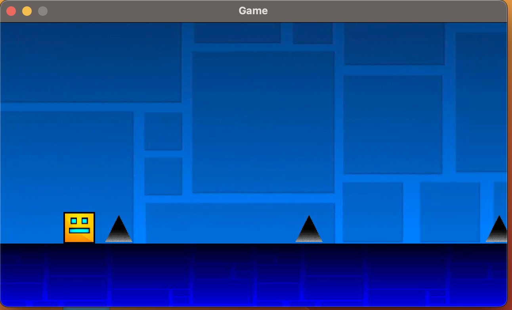

# Geometry Dash Game

I have implemented
a simplified version of the known game 'Geometry Dash' on mobile devices. The game consists in you,
a square, having to jump to dodge obstacles while trying to reach the end of the map. You win by reaching 
the end, and you lose if you crash into a block or if you touch a spike. You can dodge these obstacles by jumping
using any key on the keyboard and timing your jumps accordingly.

The square rotates mid-air when jumping or dropping. Jumping causes a 180º rotation while dropping causes a 90º one.
Drops happen when you are on a high level, don't jump and don't have any blocks below you, mimicking the effects of gravity
in real life.

All libraries and external sources are provided on the lib folder. 

# How to play

- Jump by selecting any key
- Dodge the spikes and don't crash into a block
- Reach the end to win

# Getting Started

In order to play the game, you must run the Game.scala file under src/view. Then, you must click on the big play button in the 
center of the screen to begin. After this, the game will begin. After losing, you will immediately respawn at the beginning of the map
until you reach the end.

# Multimedia

Here you can see a picture and a video showcasing the game in action

Video Showcase Link: https://video.vu.nl/media/GeometryDashGameVideo/1_2bgwhv6q
